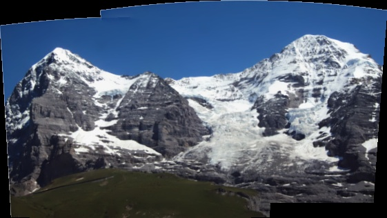
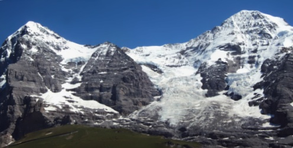

# 🧵 Image Stitching Project

This project performs **automatic image stitching** to generate a seamless panorama from a set of overlapping images. It utilizes **OpenCV** for feature detection, matching, and blending, and includes post-processing to remove any unwanted borders.

---

## 🖼️ Example Use Case

Given a folder of related images, such as mountain scenery taken from different angles or positions, the script automatically aligns and merges them into a single panoramic image.

---

## 📁 Project Structure

```
Image Stitching Project/
├── Dataset/
│   └── Mountain/
│       ├── img1.jpg
│       ├── img2.jpg
│       └── ...
├── Result/
│   └── Mountain/
│       ├── output1.jpg   # Raw stitched image
│       └── output2.jpg   # Cropped & post-processed result
├── image_stitching.py
└── README.md
```

---

## 🚀 How It Works

1. **Loads images** from the specified dataset folder.
2. **Uses OpenCV's Stitcher API** to stitch them into a panorama.
3. **Adds a border** and converts the image to grayscale.
4. **Removes black borders** through thresholding and contour-based cropping.
5. **Saves both raw and cleaned stitched images**.

---

## ⚙️ Configuration

Modify the following variables in the script as needed:

```python
dataset_name = 'Mountain'    # Folder name inside the Dataset directory
threshold = 0.97             # Threshold to determine if the black border is significant
```

---

## 🧪 Requirements

- Python 3.x
- OpenCV
- imutils
- numpy

Install dependencies:

```bash
pip install opencv-python imutils numpy
```

---

## ▶️ Running the Project

```bash
python image_stitching.py
```

After execution:
- `output1.jpg` will be the initial stitched result.
- `output2.jpg` will be the cleaned and cropped panorama.

---

## 📸 Screenshots

| Raw Stitch | Cropped & Final Result |
|------------|------------------------|
|  |  |

---

## ❗ Troubleshooting

- If you see **"Images could not be stitched"**, ensure:
  - All images overlap with consistent features.
  - Sufficient number of keypoints can be detected.
  - Images are not too distorted or dissimilar.

---

## 📌 Notes

- Works with OpenCV version 3 and 4.
- Designed for horizontal or vertical panoramas.
- Add your custom image set under the `Dataset` directory.

---
